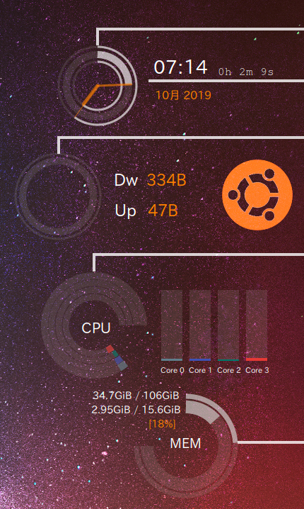
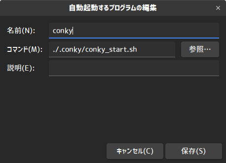

# conky 設定ファイル
デスクトップに常駐するタスクマネージャconkyの設定ファイル  
Conky-MinimalizmをUbuntu用に調整  
下図のような表示になる  

## 使用環境
Ubuntu 18.04  
conky 1.10.8

## 使い方
1. conkyインストール

    `sudo apt install conky`

1. このフォルダをフォルダ名「.conky」としてhomeディレクトリに配置
1. conky_start.shに実行権限を与える

    `chmod +x conky_start.sh`

1. conky_start.shをスタートアップに追加

    

1. 再起動

## 参考
https://github.com/NoTranslation/Conky-Minimalism
